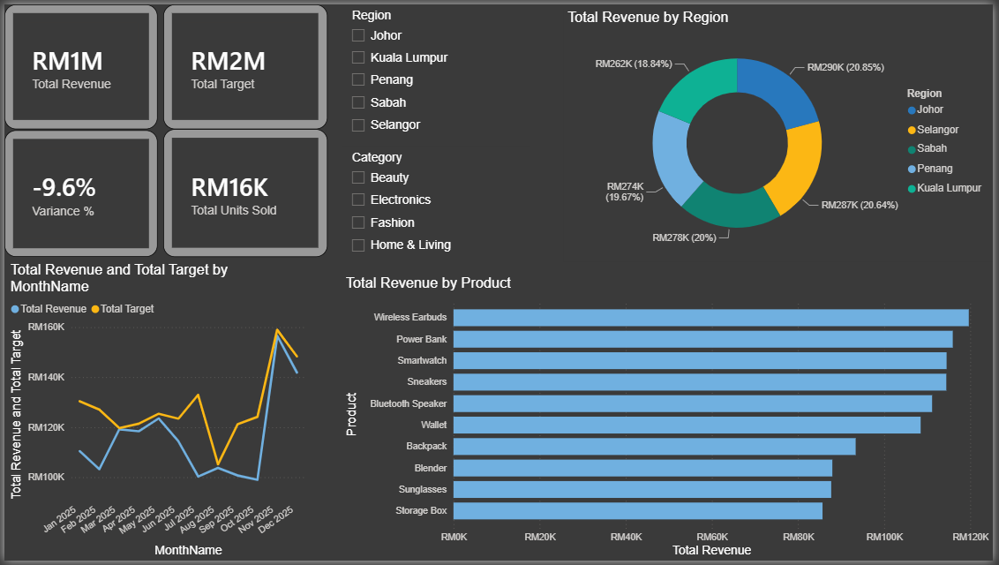

# Sales Performance Dashboard — Power BI

An interactive Power BI dashboard tracking revenue performance, target variance, and top-performing products across a simulated retail sales dataset (2,237 transactions, 5 regions, 4 product categories, 12 months).


<!-- Replace screenshot.png with your actual exported image, same folder as this README -->

## What it does

- Tracks **Total Revenue vs Target** month over month to spot performance gaps early
- Breaks down revenue by **region** and **top-selling products**
- Lets users filter the whole view by **region** and **category** using interactive slicers
- Surfaces overall **variance %** against target as a single headline metric

## Why I built it

I wanted hands-on experience with the BI tooling companies actually use for reporting — not just Excel pivot tables, but a proper semantic model with relationships and DAX. This project simulates a realistic sales-reporting scenario: raw transactions in one table, targets set separately by region and month in another, and a dashboard that has to reconcile both.

## Data model

Three tables, connected through a dedicated date table:

- **Sales_Transactions** — one row per order (date, region, salesperson, category, product, units sold, unit price, revenue)
- **Monthly_Targets** — revenue target per region per month
- **DateTable** — a calculated calendar table (`CALENDAR()` in DAX), used to join both tables consistently and enable proper chronological sorting

Relationships:
- `DateTable[Date]` → `Sales_Transactions[OrderDate]` (one-to-many)
- `DateTable[MonthKey]` → `Monthly_Targets[Month]` (many-to-many, single-direction filtering)

## Key DAX measures

```DAX
Total Revenue = SUM(Sales_Transactions[Revenue])
Total Target = SUM(Monthly_Targets[RevenueTarget])
Variance = [Total Revenue] - [Total Target]
Variance % = DIVIDE([Variance], [Total Target], 0)
Avg Order Value = DIVIDE([Total Revenue], DISTINCTCOUNT(Sales_Transactions[OrderID]), 0)
```

## Tech stack

Power BI Desktop, DAX, Power Query (data cleaning and type transformation)

## Files

- `Sales_Performance_Dashboard.pbix` — the full Power BI file
- `Sales_Transactions.csv` / `Monthly_Targets.csv` — the underlying dataset

## Notes

This uses a synthetic dataset generated for practice purposes (seasonal Nov/Dec revenue bump included to make trend analysis meaningful). Built as a self-directed project with no prior Power BI experience going in.
